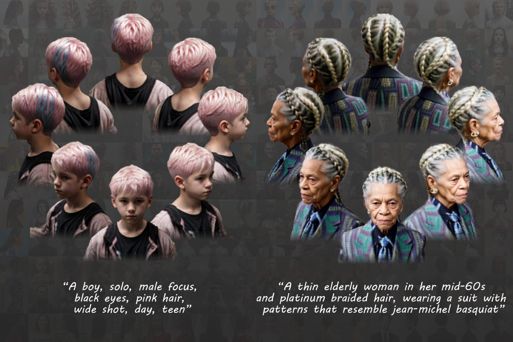

# Portrait3D

> **[SIGGRAPH 2024] Portrait3D: Text-Guided High-Quality 3D Portrait Generation Using Pyramid Representation and GANs Prior**
>
> [Yiqian Wu](https://onethousandwu.com/), [Hao Xu](https://xh38.github.io/), [Xiangjun Tang](https://yuyujunjun.github.io/), [Xien Chen](https://vision.cs.yale.edu/members/xien-chen.html), [Siyu Tang](https://inf.ethz.ch/people/person-detail.MjYyNzgw.TGlzdC8zMDQsLTg3NDc3NjI0MQ==.html),  Zhebin Zhang, Chen Li, [Xiaogang Jin*](http://www.cad.zju.edu.cn/home/jin)

[Paper]()    [Supplementary (Google Drive)]()    [Project Page]()

This is the official code repository for our SIG'24 paper: "Portrait3D: Text-Guided High-Quality 3D Portrait Generation Using Pyramid Representation and GANs Prior".




## News ✨

- Our paper has been **accepted by SIGGRAPH 2024** !
- We have released all the source code and pre-trained models!


##  Requirements

1. Tested on Python 3.8
3. At least 12 GB of memory
4. Tested on NVIDIA RTX 3080Ti with 12 GB of memory (Windows, 1.5h per portrait)
5. Tested on NVIDIA RTX 4090 with 24 GB of memory (Linux, 0.5h per portrait)
6. CUDA>=11.6

## Installation

Clone this repo to `$PROJECT_ROOT$`.

**Create environment**

```
cd $PROJECT_ROOT$
conda env create -f environment.yaml
conda activate text_to_3dportrait
```

**Torch and torchvision Installation**

```
pip install torch==1.12.1+cu116 torchvision==0.13.1+cu116 -f https://download.pytorch.org/whl/torch_stable.html
```

**OSMesa Dependencies (For Linux)**

```
sudo apt install  libosmesa6  libosmesa6-dev
```

**Installing Additional Requirements**

```
pip install -r requirements.txt
```

**kaolin Installation** 

```
pip install kaolin==0.13.0 -f https://nvidia-kaolin.s3.us-east-2.amazonaws.com/torch-1.12.1_cu116.html
```

**Stable-diffusion Installation**

```
cd stable-diffusion
pip install -e .
cd ..
```


**SMPL Model Setup**

1. Download [SMPL_python_v.1.0.0.zip](https://smpl.is.tue.mpg.de/download.php) (version 1.0.0 for Python 2.7 (female/male. 10 shape PCs) ). Save `basicModel_f_lbs_10_207_0_v1.0.0.pkl` to `3DPortraitGAN_pyramid/smplx_models/smpl/SMPL_FEMALE.pkl`, save `basicModel_m_lbs_10_207_0_v1.0.0.pkl` to `3DPortraitGAN_pyramid/smplx_models/smpl/SMPL_MALE.pkl`.

2. Download [SMPLIFY_CODE_V2.ZIP](http://smplify.is.tue.mpg.de/), and save `basicModel_neutral_lbs_10_207_0_v1.0.0.pkl` to `3DPortraitGAN_pyramid/smplx_models/smpl/SMPL_NEUTRAL.pkl`.

| Download Link                                                | Save Path                                                |
| ------------------------------------------------------------ | -------------------------------------------------------- |
| [basicModel_f_lbs_10_207_0_v1.0.0.pkl](https://smpl.is.tue.mpg.de/download.php) | 3DPortraitGAN_pyramid/smplx_models/smpl/SMPL_FEMALE.pkl  |
| [basicModel_m_lbs_10_207_0_v1.0.0.pkl](https://smpl.is.tue.mpg.de/download.php) | 3DPortraitGAN_pyramid/smplx_models/smpl/SMPL_MALE.pkl    |
| [basicModel_neutral_lbs_10_207_0_v1.0.0.pkl](http://smplify.is.tue.mpg.de/) | 3DPortraitGAN_pyramid/smplx_models/smpl/SMPL_NEUTRAL.pkl |


## Inference 

### 3DPortraitGAN_pyramid Model

Our 3DPortraitGAN_pyramid draws inspiration from the 3D-aware StyleGAN2 backbone implemented in [SeanChenxy/Mimic3D](https://github.com/SeanChenxy/Mimic3D), and integrates concepts of mask guidance, background synthesis, and tri-grid representation adapted from [SizheAn/PanoHead](https://github.com/SizheAn/PanoHead). We extend our sincere gratitude for these significant contributions!

#### (Recommended) Pretrained models 

Download the pre-trained model of 3DPortraitGAN_pyramid:

| Download Link                                                | Description                                         | Save Path                      |
| ------------------------------------------------------------ | --------------------------------------------------- | ------------------------------ |
| [model_512.pkl](https://drive.google.com/file/d/1P6k4UwGGNmxa6-rQr2oyIOmAPiLAd_WE/view?usp=sharing) | Pre-trained model of 3DPortraitGAN_pyramid          | ./3DPortraitGAN_pyramid/models |
| [model_512.json](https://drive.google.com/file/d/1R6FoQXi4PyIvXtOVoKRohfOXkEkWXdJb/view?usp=sharing) | Pose prediction parameters of 3DPortraitGAN_pyramid | ./3DPortraitGAN_pyramid/models |
| [decoder_512.ckpt](https://drive.google.com/file/d/1r0Lqu1TMm-1Pjj8K963RVM_y72OglJdu/view?usp=sharing) | Decoder checkpoint extracted from model_512.pkl     | ./3DPortraitGAN_pyramid/models |
| [vgg16.pt](https://drive.google.com/file/d/1av5jH9jzuOobV9s2gyzx0w9a4xqco82H/view?usp=sharing) | vgg16                                               | ./3DPortraitGAN_pyramid/models |

#### (Optional)  Training

<u>Omit this section if utilizing the pre-trained 3DPortraitGAN_pyramid model aforementioned.</u>

For those interested in the training process, we kindly direct you to our training instructions available [here](https://github.com/oneThousand1000/Portrait3D/tree/main/3DPortraitGAN_pyramid).


### Random Image Generation

#### Preparing Prompts

First, prepare your prompts. These should be organized in the following structure:

```
test_data
│
└─── 001  
│   │
│   └─── prompt.txt (should initiate with "upper body photo")
└─── 002
│   │
│   └─── prompt.txt (should initiate with "upper body photo")
└─── ...
```

An example is available in `$PROJECT_ROOT$/test_data`.


#### Image generation

Download the Realistic_Vision_V5.1_noVAE model [here](https://huggingface.co/SG161222/Realistic_Vision_V5.1_noVAE).

We employ the original stable diffusion in this use case. To convert the diffusers-version model to the original-stable-diffusion-version, follow the steps below:

```
cd stable-diffusion

activate text_to_3dportrait

git clone git@github.com:huggingface/diffusers.git

cd diffusers/scripts

python convert_diffusers_to_original_stable_diffusion.py --model_path $PATH_of_Realistic_Vision_V5.1_noVAE$ --checkpoint_path $PATH_of_Realistic_Vision_V5.1_noVAE$/realisticVisionV51_v51VAE.ckpt

cd ../../../
```

Then randomly generate images:

```
cd stable-diffusion

activate text_to_3dportrait

python get_test_data_df.py --test_data_dir ../test_data --sample_num 6  --scale 5 --df_ckpt $PATH_of_Realistic_Vision_V5.1_noVAE$/realisticVisionV51_v51VAE.ckpt 

cd ..
```

The generated images will be stored at `$PROJECT_ROOT$/test_data/image_id/samples`

**Note:** We discovered that using a smaller scale (for example, ` --scale 3`) tends to generate superior results for specific characters, like ''Tyrion Lannister in the Game of Thrones''. Feel free to experiment with different scales to improve the outcome.


#### Image Processing 

Our image processing code is largely adapted from [hongsukchoi/3DCrowdNet_RELEASE](https://github.com/hongsukchoi/3DCrowdNet_RELEASE).  

**Installation**

```text
conda create -n portrait3d_data python=3.8

activate portrait3d_data

cd data_processing

pip install torch==1.10.2+cu113 torchvision==0.11.3+cu113 -f https://download.pytorch.org/whl/torch_stable.html

pip install -r requirements.txt

python -m pip install -e detectron2

cd ..
```


For windows:

```
pip install pywin32==306
```


For windows users who experience errors during detectron2 installation, please open a `x64 Native Tools Command Prompt` for Visual Studio and execute `python -m pip install -e detectron2`.


**Pretrained models**

| Download Link                                                | Save Path                                                    |
| ------------------------------------------------------------ | ------------------------------------------------------------ |
| [R_101_FPN_DL_soft_s1x.pkl](https://drive.google.com/file/d/1rgrW9bAVbarft57mogUfawRSu2JCUKIT/view?usp=sharing) | `./data_processing/detectron2/projects/DensePose`            |
| [phi_smpl_27554_256.pkl](https://dl.fbaipublicfiles.com/densepose/data/cse/lbo/phi_smpl_27554_256.pkl) | `./data_processing/detectron2/projects/DensePose`            |
| [pose_higher_hrnet_w32_512.pth](https://drive.google.com/drive/folders/1zJbBbIHVQmHJp89t5CD1VF5TIzldpHXn) | `./data_processing/HigherHRNet-Human-Pose-Estimation/models/pytorch/pose_coco` |
| [crowdhuman_yolov5m.pt](https://drive.google.com/file/d/1gglIwqxaH2iTvy6lZlXuAcMpd_U0GCUb/view?usp=sharing) | `./data_processing/yolov5_crowdhuman`                        |
| [basicModel_neutral_lbs_10_207_0_v1.0.0.pkl](http://smplify.is.tue.mpg.de/) | `./data_processing/common/utils/smplpytorch/smplpytorch/native/models` |
| [VPOSER_CKPT](https://drive.google.com/drive/folders/1KNw99d4-_6DqYXfBp2S3_4OMQ_nMW0uQ?usp=sharing) | `./data_processing/common/utils/human_model_files/smpl/VPOSER_CKPT` |
| [J_regressor_extra.npy](https://drive.google.com/file/d/1B9e65ahe6TRGv7xE45sScREAAznw9H4t/view?usp=sharing) | `./data_processing/data`                                     |
| [demo_checkpoint.pth.tar](https://drive.google.com/drive/folders/1YYQHbtxvdljqZNo8CIyFOmZ5yXuwtEhm?usp=sharing) | `./data_processing/demo`                                     |

If you encounter `RuntimeError: Subtraction, the - operator, with a bool tensor is not supported.`, you may refer to [this issue](https://github.com/mks0601/I2L-MeshNet_RELEASE/issues/6#issuecomment-675152527) for a solution or change L301~L304 of `anaconda3/lib/python3.8/site-packages/torchgeometry/core/conversion.py` to below:

```
mask_c0 = mask_d2.float() * mask_d0_d1.float()
mask_c1 = mask_d2.float() * (1 - mask_d0_d1.float())
mask_c2 = (1 - mask_d2.float()) * mask_d0_nd1.float()
mask_c3 = (1 - mask_d2.float()) * (1 - mask_d0_nd1.float())
```


Then process the randomly generated images to produce aligned images following the alignment setting of 3DPortraitGAN_pyramid:

```
cd data_processing

activate portrait3d_data
python preprocess_img_for_inversion.py --test_data_dir=$PROJECT_ROOT$/test_data

cd ..
```


**Note:** Manually review and discard any subpar images located in `$PROJECT_ROOT$/test_data/image_id/samples_new_crop/aligned_images`. For optimal inversion results, it is recommended to maintain an aligned image with a frontal view and minor body poses.


### 3D Portrait Inversion

**Inversion**

Before proceeding further, always ensure that you have removed all unsatisfactory images in `test_data/image_id/samples_new_crop/aligned_images`. This step is crucial to prevent suboptimal results.

Notice that we only run projection for the first image in `test_data/image_id/samples_new_crop/aligned_images`.

```
cd 3DPortraitGAN_pyramid

activate text_to_3dportrait

python run_inversion_with_pose_optimization.py \
	--model_pkl=./models/model_512.pkl \
	--pose_prediction_kwargs_path=./models/model_512.json \
	--test_data_dir=../test_data \
	--inversion_name=final_inversion \
	--with_pose_optim
```


**Generate Pyramid Tri-grid from Inversion results**

```
python run_trigrid_gen.py  \
	--network=./models/model_512.pkl \
    --inversion_name=final_inversion
    
cd ..
```


### 3D Portrait Generation and Optimization

Our image generation code is largely adapted from [ashawkey/stable-dreamfusion](https://github.com/ashawkey/stable-dreamfusion). We express our gratitude for their significant contributions!

```
cd stable-dreamfusion-3DPortrait

python portrait3d_main.py \
	--trigrid_decoder_ckpt=../3DPortraitGAN_pyramid/models/decoder_512.ckpt \
	--inversion_name=final_inversion \
	--network_path=../3DPortraitGAN_pyramid/models/model_512.pkl \
	--test_data_dir=../test_data  \
	--df_ckpt=$PATH_of_Realistic_Vision_V5.1_noVAE$ 
```

The results will be stored and organized as:

```
stable-dreamfusion-3DPortrait/output/text_to_3dportrait/image_id
│
└─── trigrid.pkl [Original pyramid tri-grid generated from inversion results]
│
└─── validation [SDS validation images]
│
└─── checkpoints [SDS checkpoints]
│
└─── run [SDS run file]
│
└─── results [SDS rendering results]
|
└─── data [21 rendered views, refer to Section 3.5 in our paper]
|
└─── update_data [21 refined views, refer to Section 3.5 in our paper]
|
└─── log [Pyramid tri-grid optimization log files, refer to Section 3.5 in our paper]
│    │
│    └─── ckpt
│    │    │
│    │    └─── epoch_00019.pth [Final pyramid tri-grid]
│    └─── img 
│
└─── results_final [Final rendering results]
```


## Results Gallery 

We offer a gallery of 300 3D portraits (with their corresponding prompts) generated by our method, all viewable and accessible on [huggingface](https://huggingface.co/datasets/onethousand/Portrait3D_gallery).

```
Portrait3D_gallery
│
└─── 000  
│   │
│   └─── 000_pyramid_trigrid.pth [the pyramid trigrid file] 
│   │
│   └─── 000_prompt.txt [the prompt]
│   │
│   └─── 000_preview.png [the preview image]
│   │
│   └─── ...
└─── 001
│   │
│   └─── ...
└─── 002
│   │
│   └─── ...
│
└─── ...
```

To visualize these  3D portraits, use the following visualizer:

```
cd 3DPortraitGAN_pyramid

activate text_to_3dportrait

python pyramid_trigrid_visualizer.py
```

Input the path of your `model_512.pkl` into the `Pickle` field, and input the pyramid tri-grid path into the `Pyramid Tri-Grid Ckpt` field.

Please observe that we **maintain the neural rendering resolution at 256** for optimal rendering speed.


Enjoy traversing through these results 😉!


## Contact

[onethousand@zju.edu.cn](mailto:onethousand@zju.edu.cn) / [onethousand1250@gmail.com](mailto:onethousand1250@gmail.com)


## Citation

If you find this project helpful to your research, please consider citing:

```
Coming soon.
```


## Acknowledgements

The work is supported by the Information Technology Center and State Key Lab of CAD&CG, Zhejiang University. We extend our sincere gratitude for the generous provision of necessary computing resources.

We also want to express our thanks to those in the open-source community for their valuable contributions.


